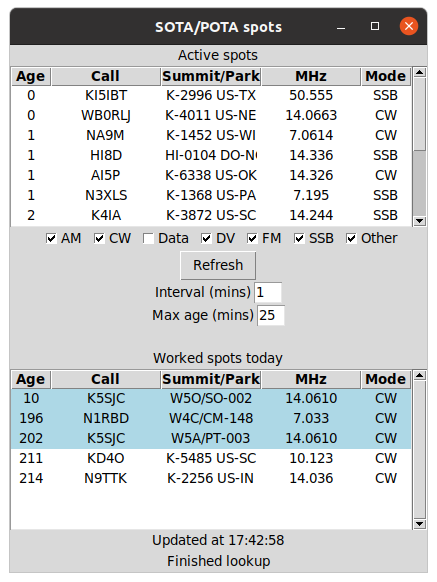

# sota-pota-scanner-python

Lists the current SOTA and POTA activations, removing outdated and duplicate entries.

You can tune your radio directly to each frequency and move spots you work to another list.

Worked entries are remembered when restarting the app, and those spots can show again after a new UTC day.

## Usage
`python main.py`

Double-click on a spot to tune your radio to that frequency.

Double-**right**-click on a spot to add or remove it from the "Worked spots today" list.

## Rig configuration (optional)

The commands to set the frequency differ depending on your radio and software setup.

Two sample methods are provided: one using Hamlib, and an serial version example for an IC-7300.

(In the default configuration, double-clicking a spot does nothing: `RIG_CONTROL = rig.rig_control.DummyRig`)

Choose the method by editing **rig.cfg**:

#### Hamlib method
- (for Linux) `sudo apt install python3-libhamlib2`
- Under `[RIG_CONTROL_METHOD]` set `RIG_CONTROL = rig.hamlib_rig.HamlibRig`
- Under `[HamlibRig]` set `DEVICE_ID` and `RIG_MODEL`

  (Note: the first frequency change may quickly bounce between VFOs)

#### Serial method (Icom 7300 example)
- Under `[RIG_CONTROL_METHOD]` set `RIG_CONTROL = rig.serial_7300_rig.Serial7300Rig`
- Under `[Serial7300Rig]` set `SERIAL_PORT` and `BAUD_RATE`

#### To use another method:
- Create a `Rig` subclass which implements `set_vfo()`
- Under `[RIG_CONTROL_METHOD]` set `RIG_CONTROL` to your class ("package.class" format)
- Create a new configuration section matching your class name and add the parameters

## Extending

To add another data source, create a subclass of `GenericLookup` and add it to `all_lookups` in `data_fetcher.py`.

The color of each data source can be changed with `tv.tag_configure` in `main.fill_treeview()`
